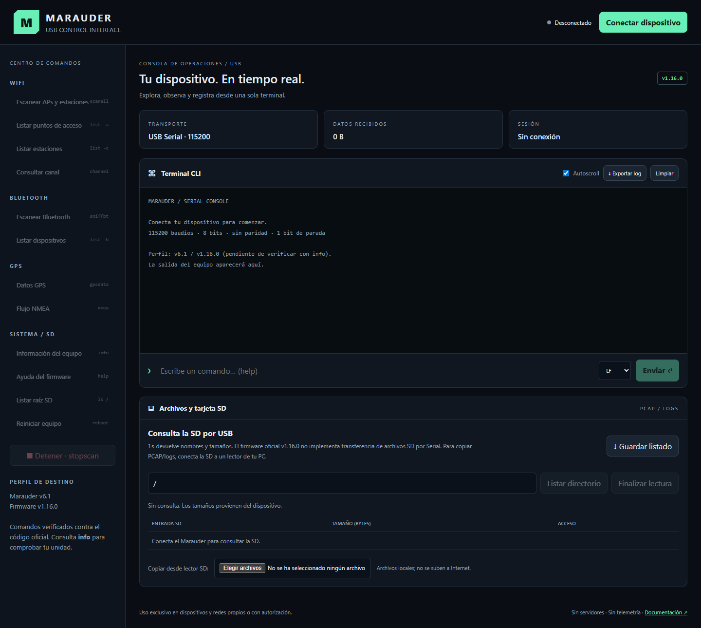
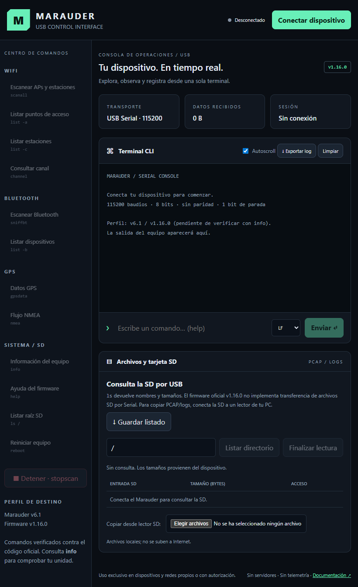

# marauder-v6-web-gui

Interfaz web autónoma en español para controlar un **ESP32 Marauder v6.1**, con firmware oficial **v1.16.0**, por USB a **115200 baudios**. HTML, CSS y JavaScript están embebidos en `index.html`: sin compilación, dependencias de producción, CDN, cuentas ni backend.



## Qué incluye

- Diseño oscuro adaptable a escritorio, tablets y pantallas pequeñas.
- Conexión manual mediante Web Serial, estado visual, cierre de lectores/escritores y manejo de desconexión física.
- Terminal de texto en tiempo real, decodificación UTF-8 incremental, comandos libres, historial con ↑/↓ y LF/CRLF.
- Accesos WiFi, Bluetooth, GPS y Sistema/SD. Cada botón muestra el comando que envía.
- Listado SD por Serial, exportación del listado, exportación del registro de sesión y copia binaria de archivos seleccionados desde un lector SD local.
- Prueba de navegador reproducible con un puerto serie simulado.

## Compatibilidad y precisión de comandos

El mapeo se verificó contra el **tag oficial v1.16.0**, commit `fe2160f0aa53ad8e6c5860f8dddd6e7bbaa3ba0b`, en [CommandLine.h](https://github.com/justcallmekoko/ESP32Marauder/blob/fe2160f0aa53ad8e6c5860f8dddd6e7bbaa3ba0b/esp32_marauder/CommandLine.h) y [CommandLine.cpp](https://github.com/justcallmekoko/ESP32Marauder/blob/fe2160f0aa53ad8e6c5860f8dddd6e7bbaa3ba0b/esp32_marauder/CommandLine.cpp).

**`scanap` no existe en ese código.** Se utiliza `scanall`, que escanea puntos de acceso y estaciones. La terminal permite introducir comandos propios de un fork, pero no se presupone que sean compatibles con el firmware oficial.

| Categoría | Botón | Comando exacto |
| --- | --- | --- |
| WiFi | Escanear APs y estaciones | `scanall` |
| WiFi | Listar puntos de acceso | `list -a` |
| WiFi | Listar estaciones | `list -c` |
| WiFi | Consultar canal | `channel` |
| Bluetooth | Escanear Bluetooth | `sniffbt` |
| Bluetooth | Listar dispositivos | `list -b` |
| GPS | Datos GPS | `gpsdata` |
| GPS | Flujo NMEA | `nmea` |
| Sistema | Información | `info` |
| Sistema | Ayuda | `help` |
| Sistema | Reiniciar | `reboot` |
| SD | Listar raíz | `ls /` |
| Global | Detener | `stopscan` |

GPS y Bluetooth dependen de las capacidades compiladas y del hardware presente. `gpsdata` y `nmea` inician flujos; usa `stopscan` antes de cambiar de operación. `reboot` pide confirmación en la interfaz.

El perfil solicitado indica ESP-IDF `v5.5.1-710-g8410210c9a`, WSL Bypass habilitado, SD conectada de 3839 MB y monitor de batería no soportado. Son datos proporcionados para la unidad, **no mediciones realizadas por esta aplicación**. Las MAC del propietario no se incluyen en el repositorio. Ejecuta `info` y `help` para verificar tu compilación real. El nombre de versión por sí solo no identifica cambios de un fork.

## Uso local

1. Descarga o clona el repositorio y entra en su carpeta.
2. Sirve los archivos desde localhost, por ejemplo con Python:

   ```sh
   python -m http.server 8080 --bind 127.0.0.1
   ```

3. Abre `http://localhost:8080` en Chrome o Edge de escritorio con Web Serial disponible.
4. Conecta el Marauder con un cable USB de datos. Cierra monitores serie de Arduino, flasheadores y otras aplicaciones que ocupen el puerto.
5. Pulsa **Conectar dispositivo** y selecciona el puerto correcto en el selector del navegador.
6. Ejecuta **info** y **help**. La interfaz no envía comandos automáticamente al conectar.
7. Selecciona una operación. Para detenerla, usa **Detener · stopscan**. Envía comandos manuales con Enter o Enviar.
8. Exporta el log antes de cerrar la página y pulsa **Desconectar** para liberar el puerto.

Configuración: 115200, 8 bits, sin paridad, 1 bit de parada, sin control de flujo. LF es el valor inicial porque el firmware lee hasta `\n`. CRLF también está disponible.

Web Serial requiere contexto seguro (HTTPS o localhost) y soporte del navegador/sistema. El diseño funciona en tablets, pero **eso no garantiza acceso USB Serial** en Android, iPadOS o todos los navegadores. La interfaz comprueba la disponibilidad y muestra una explicación si falta. Referencia: [documentación de Web Serial de Chrome](https://developer.chrome.com/docs/capabilities/serial).

## SD, PCAP y logs: alcance real

El comando `ls <directorio>` de v1.16.0 devuelve líneas `nombre<TAB>tamaño`. [SDInterface.cpp](https://github.com/justcallmekoko/ESP32Marauder/blob/fe2160f0aa53ad8e6c5860f8dddd6e7bbaa3ba0b/esp32_marauder/SDInterface.cpp) no añade un marcador de finalización o un tipo de entrada al listado. La GUI no infiere carpetas a partir de tamaño cero.

**El firmware oficial no proporciona un comando CLI para descargar archivos arbitrarios de la SD por Serial.** `ls /` no transmite el contenido de los PCAP. No se implementa una descarga USB ficticia ni se guardan bytes de terminal como si fueran un PCAP.

### Consultar por USB

1. Detén cualquier escaneo con `stopscan` y espera a que deje de emitir datos.
2. Introduce `/` o una ruta absoluta sin espacios/comillas y pulsa **Listar directorio**.
3. Se recogen respuestas fragmentadas del puerto y se reconocen líneas con nombre y tamaño.
4. Pulsa **Finalizar lectura** cuando termine. A los 30 segundos se cierra la ventana de recepción con un aviso de posible resultado incompleto.
5. Usa **Guardar listado** para exportar el texto recibido. La consulta bloquea temporalmente otros botones de envío para reducir respuestas mezcladas; puedes finalizarla en cualquier momento.

Una SD vacía, ausente o una ruta inválida pueden no producir salida. La aplicación no puede distinguirlas de forma fiable solo con `ls`. El listado no indica éxito ni integridad. Se muestran hasta 2000 entradas y se retienen hasta 2 MiB de texto.

### Copiar los archivos reales

1. Detén la captura y espera a que el firmware termine de escribir. Apaga el equipo antes de retirar la SD.
2. Conecta la SD a la PC con un lector.
3. En **Copiar desde lector SD**, selecciona los archivos PCAP, PCAPNG, LOG, TXT o CSV.
4. Pulsa **Guardar copia** junto a cada archivo y elige el destino mediante el navegador. Los bytes del archivo se conservan sin decodificación de texto. También puedes copiarlos directamente desde el explorador del sistema.

Para descarga íntegra por el mismo cable USB haría falta extender el firmware con un protocolo de transferencia que defina tamaño, encuadre, comprobación de integridad, errores y cancelación; ese cambio no forma parte de esta GUI compatible con el firmware oficial.

**Exportar log** descarga el texto de sesión recibido y los comandos enviados, no archivos de la SD. La memoria retiene los últimos 2 MiB de caracteres aproximadamente; la vista conserva los últimos 250 000 caracteres. **Limpiar** limpia solo la vista. Recargar/cerrar borra los datos de sesión; no hay almacenamiento persistente.

## GitHub Pages

`index.html` está listo para alojarse en GitHub Pages desde la raíz:

1. Sube el contenido de esta carpeta al repositorio `marauder-v6-web-gui`.
2. Ve a **Settings → Pages → Build and deployment → Deploy from a branch**.
3. Selecciona **main** y **/(root)**, guarda y espera al despliegue.
4. Abre la dirección HTTPS que muestra GitHub. El puerto se selecciona en la computadora de quien abre la página, no en GitHub.

Para crear el repositorio desde la terminal, si aún no existe:

```sh
git init -b main
git add .
git commit -m "Add Marauder v1.16.0 Web Serial GUI"
gh auth login
gh repo create marauder-v6-web-gui --public --source=. --remote=origin --push
```

No subas capturas de tráfico reales, contraseñas, registros de sesión ni información personal. `.gitignore` excluye PCAP y logs comunes, pero debes revisar lo que publicas.

## Seguridad y uso autorizado

Utiliza el equipo y esta interfaz únicamente en redes/dispositivos propios o con autorización explícita de sus responsables. Define el alcance antes de una evaluación. La captura de tráfico puede contener datos personales o confidenciales; respeta la normativa aplicable y protege los archivos exportados. El usuario es responsable de los comandos introducidos en la terminal.

La interfaz renderiza los datos serie y nombres de archivo con `textContent`, no como HTML. No ejecuta scripts recibidos por USB. No carga recursos remotos ni envía datos de sesión por red; su CSP bloquea conexiones de red del documento. El navegador solicita acceso al puerto y a los archivos locales. No se publican automáticamente los datos de la unidad.

La CLI libre permite operaciones del firmware más allá de los botones. **Desconectar el puerto o cerrar la página no detiene una operación autónoma del Marauder**: usa `stopscan` antes. El programa no controla el firmware ni puede garantizar su comportamiento.

## Captura en tablet



Ambas capturas son renders reales de la interfaz sin dispositivo conectado; no representan una sesión física ni resultados de escaneo.

## Pruebas y limitaciones

```sh
npm install --no-save playwright
npx playwright install chromium
node tests/browser.cjs
```

La prueba levanta un servidor temporal en localhost y simula `navigator.serial`: apertura a 115200, comandos y LF/CRLF, UTF-8 fragmentado, texto no confiable, listado SD fragmentado, rechazo de caracteres de control, copia binaria, desconexión/reconexión y adaptación móvil/tablet. Regenera las capturas de `docs/`.

Para usar Edge instalado, establece `BROWSER_CHANNEL=msedge` en el entorno. `PLAYWRIGHT_MODULE` permite indicar una instalación externa de Playwright.

**No se realizaron pruebas contra un Marauder físico.** La terminal es de texto; no emula secuencias ANSI ni una terminal de pantalla completa. La compatibilidad exacta con la compilación del usuario debe comprobarse con el equipo conectado.

## Archivos

- `index.html`: aplicación completa y autónoma.
- `README.md`: uso, compatibilidad y límites.
- `docs/desktop.png`, `docs/tablet.png`: capturas reales de la GUI.
- `tests/browser.cjs`: pruebas de integración con puerto simulado.
- `.nojekyll`: alojamiento estático sin procesamiento Jekyll.

Proyecto independiente, sin afiliación al autor de ESP32 Marauder. Referencia de versión: [release oficial v1.16.0](https://github.com/justcallmekoko/ESP32Marauder/releases/tag/v1.16.0).
